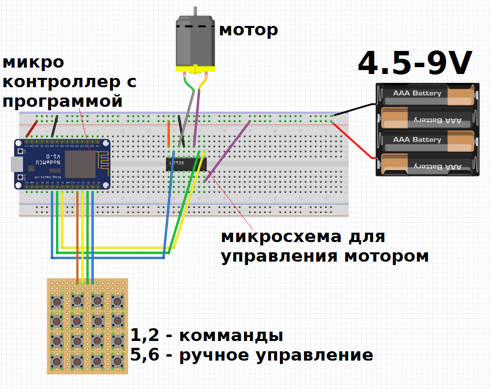
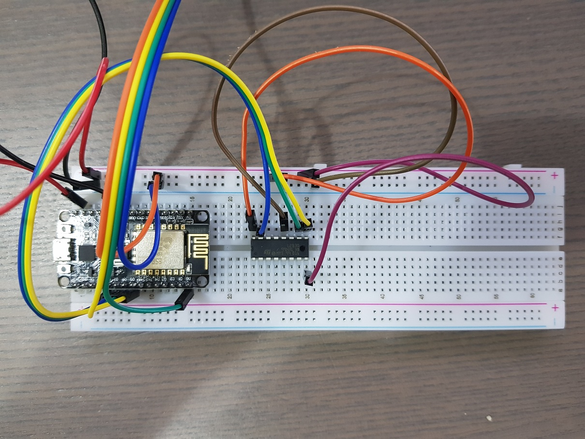
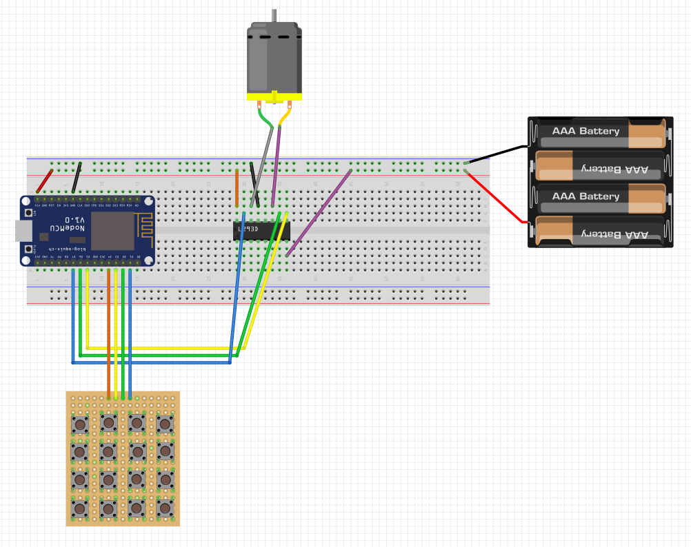
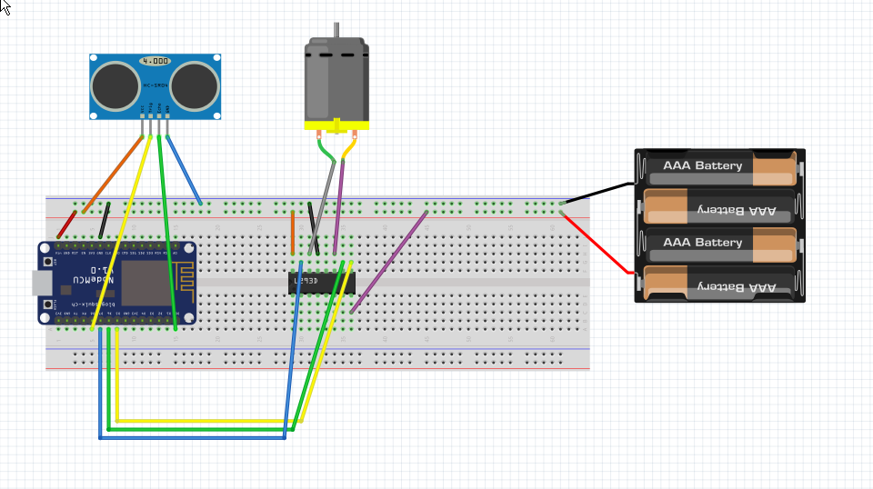

# kids-robotics-club2018-ru

Компоненты: 

- микроконроллер nodemcu v2 (совместимый с ардуино)
- чип (драйвер L293D) для управления мотором 
- мотор 3-9V
- ультразвуковой сенсор hc-sr04
- блок кнопок
- макетная доска
- провода
- LED 3V

ВАЖНО: не поключайте USB провод от зарядки в сети 220V напрямую к устройству. Используйте powerbank или порт в ноутбуке. Так же в комплекте идет держатель для 4х батареек. 

## Программы и подключение 

### С кнопками

Исходный код программы находится в папке withbuttons
 

Кнопки пронумерованы. Для подключения используются 4 контакта в середине. При использовании других контактов, будут работать другие кнопки.

### С сенсором

Исходный код программы находится в папке withsonar

Расстояние примерно 3-20 см. Прямое попадание лучей от источников света может временно нарушить работу датчика. 

## Загрузка программ

1. Установить ArduinoIDE
1. Установить поддержку nodeMCU
    1. File -> Preferences -> Additional Board URL -> http://arduino.esp8266.com/stable/package_esp8266com_index.json
    1. Tools -> Board -> Board manager -> esp8266 -> Install
1. Подключить USB компьютер, и micro-USB в контроллер
1. Выбрать программу
1. Загрузить программу на контролер: нажать на стрелочку в верхнем левом углу
1. Отсоединить провод
1. Подключить внешний источник питания к + и -

Загрузка программы занимает 20-200 секунд.

